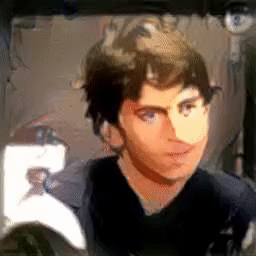
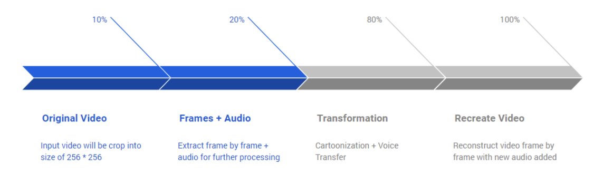
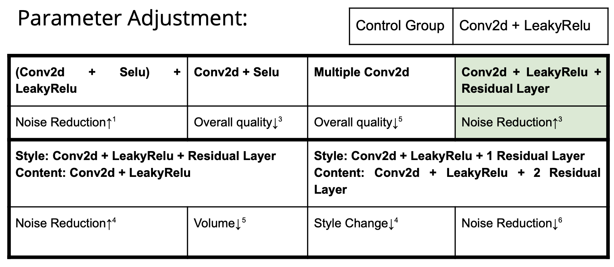

# 390NIP-final-project
CS390 final project

## Pipeline Overview 

---------
## Cartoonization(Style Transfer) :
* Preprocessing :
  * Select a suitable style picture (that resembles the original video colorwise) 
  * Capture from video frame by frame and crop out the area where the face is
  * Smoothen the edges of the style image
* Style transfer :
  * Transfer style onto each frame using a pre-trained VGG19 model 
* Extract edges from frames :
  * Run the canny edge detector to extract the outline of the frames 
  * Remove the background and make transparent 
  * Layer the outline image onto the cartoon frame

## Speech Style Transfer
___________
#### PHONETIC POSTERIORGRAMS FOR MANY-TO-ONE VOICE CONVERSIONWITHOUT PARALLEL DATA TRAINING
1. Tried to Implement  Paper
    https://www.researchgate.net/publication/307434911_Phonetic_posteriorgrams_for_many-to-one_voice_conversion_without_parallel_data_training
2. The model is seperated into two seperated trainable network
3. First network is trained to output phoneme and duration graph (PPG) for certain frequency
4. First network convert audio file into amplitude vs time graph to process the input with the timit dataset
5. Second network insert its input style audio file to first trained network to get PPG
6. Second network get relationship between calculated PPG and MCEPs
7. The whole model insert content audio file to first network to get PPG
8. The whole model insert recieved PGG to Second Network to get MCEP correspond to it perform conversion.
9. Combine Calculated MCEP and content audio file's MFCCs to create new audio file
10. However, this implementation stopped at research stage because structure of model is too complicated and TIMIT Dataset cost hug money to using it
-----------
#### Voice style transfer with random CNN
##### Progress
1. Found a project with simpler concept (similar to image style transfer) with no dataset requirement
https://github.com/mazzzystar/randomCNN-voice-transfer
2. Decided to do tranlation from pytorch to tensorflow
3. Finished Creating Pipeline, Loading, Preprocessing, Saving the Processed Data
4. Tried to find pretrained model for audio as a replacement for vgg in image style transfer
5. Failed to get speech related pretrained model like wavenet, ctc
6. Tried to use VGG instead by converting the spectrum graph (frequency vs amplitude) image insead of raw data
7. Failed due to input shape limitation of vgg
8. Successfully got content, style, total loss value in tensorflow 1, but failed to get gradient
9. Decided to do translation with tensorflow 2 instead.

##### Concept
1. Convert both audio files to Amplitude and Sampling Rate
2. Set a window_length to do each STFT conversion for amplitude
3. Calculate overlapping period of pattern in window_length 
4. Use overlapping period perform STFT conversion from amplitude to Frequency Magnitude
5. Log the Frequency Magnitude to compress data for faster calculation
6. Instead of using pretrained model like VGG or CTC, 
use a convolutional layer with relu activation to create model

##### Optimization:

* Idea from: https://openreview.net/pdf?id=BybQ7zWCb

